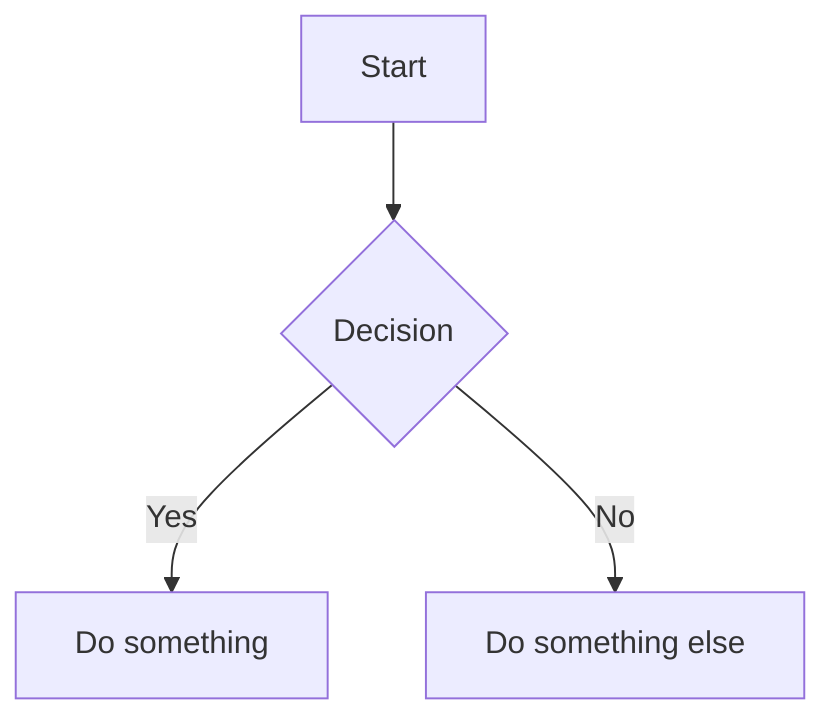

# Epistery Wiki Agent

Decentralized wiki with IPFS storage and epistery authentication.

## Overview

The wiki agent provides a collaborative documentation system that stores content on IPFS, uses epistery data wallets for ownership tracking, and supports the same authentication flow as other epistery agents (like message-board).

**Key Features:**
- IPFS-based storage (content-addressable, decentralized)
- Epistery authentication (wallet-based, no passwords)
- WikiWord support (CamelCase auto-linking)
- Mermaid diagrams (replacing PlantUML)
- Markdown rendering via marked

## Architecture

```
Publisher's Site (mydomain.com)
    |
    v
Epistery Host (epistery.mydomain.com)
    |
    +-- Wiki Agent (/agent/epistery/wiki/*)
    |       |
    |       +-- Document index (data wallet)
    |       +-- Document content (IPFS)
    |
    +-- White-list Agent (access control)
```

## Installation

To install the wiki agent on an epistery-host server:

```bash
# The wiki agent directory should be in the epistery workspace
cd ~/.epistery/.agents
# or wherever your epistery-host looks for agents

# Install dependencies
cd wiki
npm install

# Restart epistery-host to load the agent
# Agent will be auto-discovered and mounted at /agent/epistery/wiki/*
```

## API Endpoints

### `GET /agent/epistery/wiki/:docId`

Get a wiki document.

**Response:**
```json
{
  "_id": "Home",
  "title": "Home",
  "body": "# Welcome\n\nContent here...",
  "visibility": "public",
  "_modified": "2025-12-12T00:00:00.000Z"
}
```

### `POST /agent/epistery/wiki/:docId` (or PUT)

Create or update a document. Requires authentication.

Both POST and PUT are accepted, so you can naturally say "post to the wiki".

**Request Body:**
```json
{
  "title": "My Page",
  "body": "# My Page\n\nContent...",
  "visibility": "public",
  "_pid": "Home"
}
```

### `DELETE /agent/epistery/wiki/:docId`

Delete a document. Requires authentication.

### `GET /agent/epistery/wiki/index`

Get list of all documents.

**Response:**
```json
[
  {
    "_id": "Home",
    "title": "Home",
    "listed": true,
    "rootmenu": true,
    "visibility": "public"
  }
]
```

### `GET /agent/epistery/wiki/status`

Get wiki status and statistics.

## Client Integration

### Browser

```html
<!-- Load client -->
<script src="/agent/epistery/wiki/client.js"></script>

<script>
  const wiki = new WikiClient();
  await wiki.init();

  // Load and render a document
  const container = document.getElementById('wiki-content');
  await wiki.loadAndRender('Home', container);

  // Or load document separately
  const doc = await wiki.get('MyPage');
  const html = await wiki.render(doc.body);
</script>
```

### CLI (Epistery CLI)

```bash
# Read a page
epistery curl https://wiki.rootz.global/agent/epistery/wiki/Home

# Post to the wiki (create/update a page)
epistery curl -X POST -d '{"title":"Test","body":"# Test Page"}' \
  https://wiki.rootz.global/agent/epistery/wiki/TestPage
```

## Markdown Extensions

### WikiWords

CamelCase words are automatically converted to wiki links:

```markdown
See the ArchitectureGuide for more details.
```

Becomes: `See the [ArchitectureGuide](/wiki/ArchitectureGuide) for more details.`

### Mermaid Diagrams

````markdown

````

### Frames

Embed iframes:

````markdown
```frame
Dashboard[height:400px]/metrics/dashboard
```
````

## Authentication

The wiki uses the same authentication as other epistery agents:

1. **Browser**: Epistery witness (key exchange)
2. **CLI/Bot**: Bot authentication header with signed message
3. **Session**: Cookie-based session after initial auth

### Permission Model

- **Read**: Public documents are readable by anyone
- **Write**: Requires being on `wiki::writers` list or `epistery::admin` list
- **Delete**: Requires document ownership or admin

## Storage

Documents are stored in two places:

1. **Index**: Data wallet (`wiki::index`) - metadata for all documents
2. **Content**: IPFS - actual document content (body, title)

This separation allows:
- Fast index queries without loading all content
- Content deduplication via IPFS
- Ownership tracking via data wallets

## Configuration

In `epistery.json`:

```json
{
  "config": {
    "requireIdentity": false,
    "defaultMode": "passive",
    "rootDoc": "Home"
  }
}
```

## Development

```bash
# Install dependencies
npm install

# The agent is loaded by epistery-host
# For development, run epistery-host with this agent in the agents directory
```

## Differences from wiki-mixin

| Feature | wiki-mixin | wiki agent |
|---------|-----------|------------|
| Storage | MongoDB | IPFS + Data Wallets |
| Auth | Componentry accounts | Epistery wallet |
| Diagrams | PlantUML | Mermaid |
| Dependencies | Componentry | Express only |

## License

MIT
